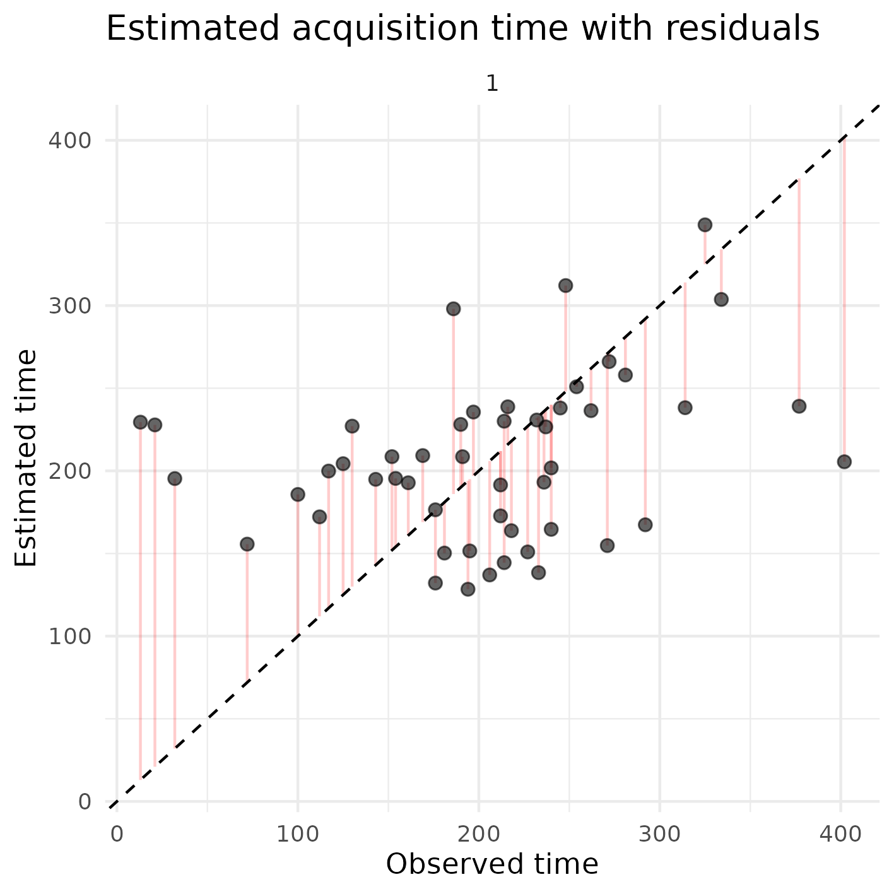

# STbayes

<!-- badges: start -->
<!-- badges: end -->

STbayes (SocialTransmissionbayes[ian]) is a package for building and running Bayesian inferential models of social transmission across static or dynamic networks. Users may supply their own data in formats given below, or import nbdaData objects directly from the [NBDA package](https://github.com/whoppitt/NBDA).

STbayes can currently accomodate:
 - ILVs for additive and multiplicative transmission models
 - static and dynamic networks
 - multiple diffusion trials
 - multi-network comparison (with static or dynamic networks)
 - varying effects for individuals for strength of social transmission and baseline hazard rates.

This package is under development and is not guaranteed to work.

## Installation

The functions of this package depend on ```rstan``` and ```coda```. You can install ```coda``` through CRAN as usual. You can install ```rstan``` by following the instructions on their [repository](https://github.com/stan-dev/rstan/wiki/RStan-Getting-Started). Don't forget to take advantage of multiple CPU cores by running after installation:

``` r
options(mc.cores = parallel::detectCores())
```

To install the development version of STbayes:

``` r
# install devtools if not already
if (!require("devtools")) install.packages("devtools")
devtools::install_github("michaelchimento/STbayes")
```

Vignettes use packages NBDA, igraph, dplyr, ggplot2, and ggpubr.

## Examples

### Worked example with simulated data

An example dataset is provided where data was simulated on a random-regular network where k=4, s=5 and the base rate was set to 0.001. You can run your own simulation in the ```simulate_data.R``` vignette.

```r
library(STbayes)
diffusion_data = STbayes::example_diffusion_data
edge_list = STbayes::example_edge_list

#generate STAN model from input data
data_list_user = import_user_STb(diffusion_data, edge_list)

#generate STAN model from input data
model_obj = generate_STb_model(data_list_user, gq=T, est_acqTime = T)

# fit model
fit = fit_STb(data_list_user, model_obj, chains = 5, cores = 5, iter=2000, control = list(adapt_delta=0.99))

# check estimates
STb_summary(fit, digits=4)
```
STb_summary outputs a formatted table of key values for parameters (incl back-transformation of variables fitted on the log scale).

```r
             Parameter   Mean Median HPDI_Lower HPDI_Upper    n_eff   Rhat
1    log_lambda_0_mean 6.8992 6.8873     6.1755     7.6616 5000.000 1.0008
2           log_s_mean 1.6120 1.6082     0.6746     2.4828 5000.000 1.0011
3 transformed_baserate 0.0011 0.0010     0.0004     0.0019 5000.000 1.0008
4        transformed_s 5.5959 4.9939     1.6104    11.2023 4339.186 1.0011
```
Estimates are not far off, but depend on network density and stochastic processes of each simulation. See vignette ```simulate_data_manytimes.R``` to quench your thirst for model validation.

STbayes also provides easy access to estimated learning times with ```extract_acqTime``` if you have fit the model with generated quantities (gq=T) and acquisition time estimates (est_acqTime=T). Generated quantities also includes log-likelihood of observations for WAIC calulations etc.

```r
#get data for estimated times
acqdata = extract_acqTime(fit, data_list_user)

#plot estimated times versus observed times w/ residuals
ggplot(acqdata, aes(x = observed_time, y = mean_time)) +
    geom_segment(
        aes(x = observed_time, xend = observed_time, y = mean_time, yend = observed_time), # connect predicted to slope line
        color = "red",
        alpha = 0.2
    ) +
    geom_point(alpha = 0.6, size=2) +
    geom_abline(intercept = 0, slope = 1, color = "black", linetype = "dashed") +
    facet_wrap(~trial, scales = "free_x") +
    labs(
        title = "Estimated acquisition time with residuals",
        x = "Observed time",
        y = "Estimated time"
    ) +
    theme_minimal()
 ```
 creates a residual plot:
 


### Import your own data

``` r
library(STbayes)

 diffusion_data <- data.frame(
   id = c("A", "B", "C", "D", "E", "F"), #this can be character or numeric
   trial = c(1, 1, 1, 2, 2, 2), #this can be character or numeric
   time = c(0, 1, 2, 0, 1, 4), #this must be numeric, integer or float. If time=0, demonstrator, if time=max_time, censored
   max_time = c(3, 3, 3, 4, 4, 4) #this is the duration of the observation period.
 )
 
 networks <- data.frame(
   trial = c(1, 1, 1, 2, 2, 2), #this can be character or numeric
   from = c("A", "A", "B", "D", "D", "E"), #this can be character or numeric
   to = c("B", "C", "C", "E", "F", "F"), #this can be character or numeric
   kin = c(1, 0, 1, 0, 1, 1), # first network
   inverse_distance = c(0, 1, .5, .25, .1, 0) #second network
 )
 
 ILV_metadata <- data.frame(
   id = c("A", "B", "C", "D", "E", "F"),
   age = c(2, 3, 4, 2, 5, 6),
   sex = c(0, 1, 1, 0, 1, 0) # Factor ILVs must be input as numeric
 )
 
 data_list <- import_user_STb(
   diffusion_data = diffusion_data,
   networks = networks,
   ILV_metadata = ILV_metadata,
   ILVi = c("age"), # Use only 'age' for asocial learning
   ILVs = c("sex") # Use only 'sex' for social learning
 )
 
 model_obj = generate_STb_model(data_list)
 
 #Obviously this model will not fit, feed it real data in the format above, or simulate data from the vignette
 fit = fit_STb(data_list, model_obj, chains = 5, cores = 5, iter=2000, control = list(adapt_delta=0.99) )
 
 # You can see a nice summary of the fit here.
 # parameters are fit on the log scale, but transformations are included in the output
 STb_summary(fit, depth=2)
 ```
 
 If fitting a multinetwork model, network weights will be in the ```w``` parameter vector, and you must include depth=2 in the call to STb_summary to see them.

### Import data from NBDA object

Create and fit model from NBDA object (taken from Tutorial 4.1 from Hasenjager et al. 2021)

``` r
library(STbayes)

#load example NBDAdata object 
nbdaData_cTADA <- STbayes::nbdaData_cTADA

#import into STbayes
data_list = import_NBDA_STb(nbdaData_cTADA)

#generate STAN model from input data
model_obj = generate_STb_model(data_list)

#fit model
fit = fit_STb(data_list, model_obj, chains = 5, cores = 5, iter=2000, control = list(adapt_delta=0.99) )

STb_summary(fit, depth=2)

#Fit cTADA model using NBDA tadaFit
library(NBDA)
model_constant<-NBDA::tadaFit(nbdaData_cTADA)
data.frame(Variable=model_constant@varNames,MLE=model_constant@outputPar,SE=model_constant@se)
#check summary ~ the same as STbayes estimates. the priors on STbayes could be adjusted to be less skeptical of the large s value
```

