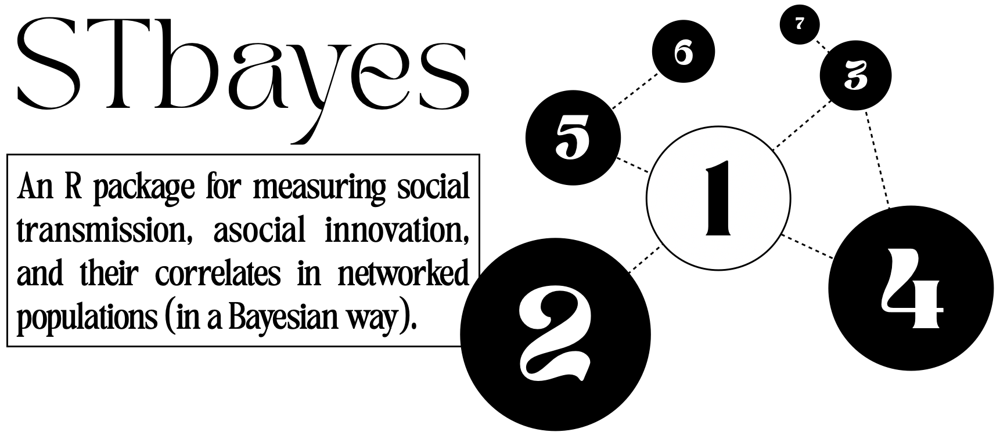
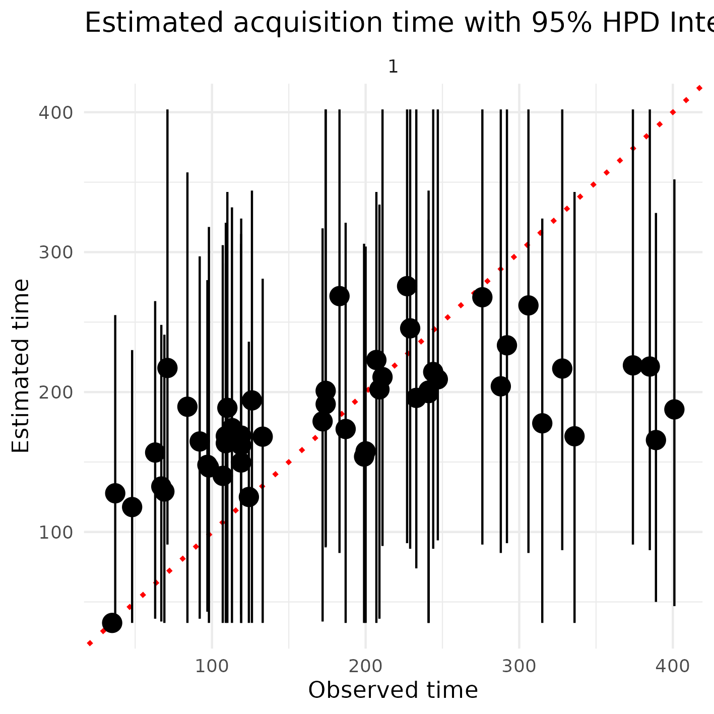
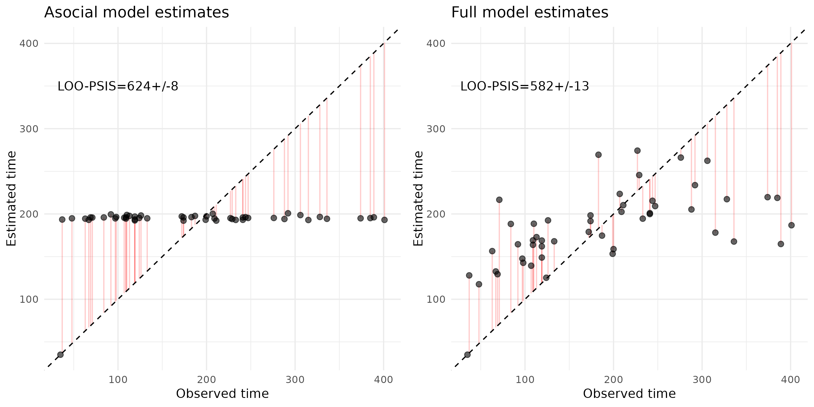

<!-- badges: start -->
<!-- badges: end -->

**STbayes** (SocialTransmissionbayes[ian]) is a package for building and running Bayesian inferential models of social transmission across static or dynamic networks. Users may supply their own data in formats given below, or import nbdaData objects directly from the [NBDA package](https://github.com/whoppitt/NBDA).

STbayes can currently accomodate:
 - cTADA (acquisition time known) and OADA (only acquisition order known) model types.
 - static and dynamic networks.
 - multi-network comparison (with static or dynamic networks).
 - multiple diffusion trials with the same set, subsets, or different sets of individuals.
 - constant and time-varying ILVs for additive and multiplicative transmission models.
 - varying effects by individual for strength of social transmission, baseline hazard rates, and other user defined ILVs.
 - Easy workflow for ELPD (loo-psis, waic) model comparison.
 - propagation of uncertainty from network measures to transmission model
   
This package is under development and is not guaranteed to work.

**Table of contents:**

1. [Installation](#Installation)
2. [Examples](#Examples)
3. [Recover parameter values from simulated data](#Recover)
4. [Compare full and asocial models](#Compare-full-asocial)
5. [Import your own data](#Import-own)
6. [Varying effects by individual](#Varying-effects)
7. [Import data from NBDA object](#Import-NBDA)
8. [Use posterior distribution of edge weights from bayesian network model](#Import-bisonr)

## Installation<a name="Installation"></a>

The functions of this package depend on ```rstan```, ```coda``` and ```loo```. You can install ```rstan``` by following the instructions on the [rstan repository](https://github.com/stan-dev/rstan/wiki/RStan-Getting-Started). Don't forget to take advantage of multiple CPU cores by running after installation:

``` r
options(mc.cores = parallel::detectCores())
```

To install the development version of STbayes:

``` r
# install devtools if not already
if (!require("devtools")) install.packages("devtools")
devtools::install_github("michaelchimento/STbayes")
```

Vignettes use packages NBDA, igraph, dplyr, ggplot2, and ggpubr.

## Examples<a name="Examples"></a>

### Recover parameter values from simulated data<a name="Recover"></a>

An example dataset is provided where data was simulated on a random-regular network where k=4, s=5 and the base rate was set to 0.001. You can run your own simulation in the ```simulate_data.R``` vignette.

```r
library(STbayes)
diffusion_data = STbayes::diffusion_data
edge_list = STbayes::edge_list

# import_user_STb formats your data for further steps
data_list_user = import_user_STb(diffusion_data, edge_list)

#generate STAN model from input data
model_obj = generate_STb_model(data_list_user, gq=T, est_acqTime = T)

# fit model
fit = fit_STb(data_list_user, model_obj, chains = 5, cores = 5, iter=2000, control = list(adapt_delta=0.99))

# check estimates
STb_summary(fit, digits=4)
```
STb_summary outputs a formatted table of key values for parameters (incl back-transformation of variables fitted on the log scale).

```r
             Parameter   Mean Median HPDI_Lower HPDI_Upper    n_eff   Rhat
1    log_lambda_0_mean 6.8992 6.8873     6.1755     7.6616 5000.000 1.0008
2           log_s_mean 1.6120 1.6082     0.6746     2.4828 5000.000 1.0011
3 transformed_baserate 0.0011 0.0010     0.0004     0.0019 5000.000 1.0008
4        transformed_s 5.5959 4.9939     1.6104    11.2023 4339.186 1.0011
```
Estimates are not far off from the parameter values used for simulation, but depend on network density and stochastic processes of each simulation. See vignette ```simulate_data_manytimes.R``` to quench your thirst for model validation.

STbayes also provides easy access to estimated learning times with ```extract_acqTime``` if you have fit the model with generated quantities (gq=T) and acquisition time estimates (est_acqTime=T). Generated quantities also includes log-likelihood of observations for WAIC calulations etc. To plot comparison of estimates versus known values:

```r
#get data for estimated times
acqdata = extract_acqTime(fit, data_list_user)

#plot estimated times versus observed times w/ residuals
ggplot(acqdata, aes(x = observed_time, y = mean_time)) +
    geom_segment(
        aes(x = observed_time, xend = observed_time, y = mean_time, yend = observed_time), # connect predicted to slope line
        color = "red",
        alpha = 0.2
    ) +
    geom_point(alpha = 0.6, size=2) +
    geom_abline(intercept = 0, slope = 1, color = "black", linetype = "dashed") +
    facet_wrap(~trial, scales = "free_x") +
    labs(
        title = "Estimated acquisition time with residuals",
        x = "Observed time",
        y = "Estimated time"
    ) +
    theme_minimal()
 ```
 

### Compare full and asocial models<a name="Compare-full-asocial"></a>

Like NBDA, we can compare a full model with both a social and asocial component, to a model restricted to estimating only an asocial rate. We can compare models using either LOO-PSIS or WAIC with ```STb_compare``` (really a convenient wrapper that automates a workflow using package ```loo```) and compare the estimated learning times from both models. First let's load and fit both models with a convenience function.

```r
library(STbayes)
library(ggplot2)

diffusion_data = STbayes::diffusion_data
edge_list = STbayes::edge_list

# format data
data_list_user = import_user_STb(diffusion_data, edge_list)

# reusable function to generate and fit a model
generate_and_fit_model <- function(data, model_type, chains = 5, cores = 5, iter = 2000, control = list(adapt_delta = 0.99)) {
    model = generate_STb_model(data, model_type=model_type, est_acqTime = TRUE)
    fit = fit_STb(data, model, chains, cores, iter, control)
    return(fit)
}


# generate, fit, and summarize models
full_fit = generate_and_fit_model(data_list_user, "full")
asocial_fit = generate_and_fit_model(data_list_user, "asocial")

#check estimates
STb_summary(full_fit, digits = 4)
STb_summary(asocial_fit, digits = 4)
```
Next we can extract the LOO-PSIS scores and add them to our plots of the estimated times:
``` r
# extract WAIC and labels
loo_output = STb_compare(full_fit, asocial_fit, method="loo-psis")
looic_full <- loo_output$loo_objects$full_fit$estimates["looic",]
looic_asocial <- loo_output$loo_objects$asocial_fit$estimates["looic",]
label_full = paste0("LOO-PSIS=", round(looic_full["Estimate"]), "+/-", round(looic_full["SE"]))
label_null = paste0("LOO-PSIS=", round(looic_asocial["Estimate"]), "+/-", round(looic_asocial["SE"]))

# reusable function for plotting
plot_acq_time <- function(fit, data, title, label) {
    acqdata = extract_acqTime(fit, data)
    p = ggplot(acqdata, aes(x = observed_time, y = mean_time)) +
        annotate("text", x = 100, y = 350, label = label) +
        geom_segment(
            aes(x = observed_time, xend = observed_time, y = mean_time, yend = observed_time),
            color = "red",
            alpha = 0.2
        ) +
        geom_point(alpha = 0.6, size = 2) +
        geom_abline(intercept = 0, slope = 1, color = "black", linetype = "dashed") +
        labs(
            title = title,
            x = "Observed time",
            y = "Estimated time"
        ) +
        theme_minimal()
    return(p)
}

# plot estimated times
p1 = plot_acq_time(asocial_fit, data_list_user, "Asocial (null) model estimates", label_null)
p2 = plot_acq_time(full_fit, data_list_user, "Full model estimates", label_full)
```


The full model describes the data much better and obtains a better (lower) LOO-PSIS score. Estimated learning times are the point estimate (mean in this case) from posterior distribution of learning times, and since individuals learn in random orders in the asocial model according to a static rate, the average time of each learner cluster around a similar time. Meanwhile, including time-varying social information allows for a better prediction of when individuals have acquired the behavior.

### Import your own data<a name="Import-own"></a>

If you'd prefer to import your own data, STbayes requires two dataframes, and accept an optional third dataframe of individual-level variables. The first dataframe gives information  about the spreading of the behavior or information and must contain columns:
- ```id```: Character or numeric (all converted to numeric, anyway) column of individual identites.
- ```trial```: Character or numeric column indicating which trial the diffusion belongs to. If there is only one diffusion, set all values to 1.
- ```time```: This is an integer or float column indicating when the individual was recorded as first informed/knowledgable. If an ID was a **pretrained demonstrator, or otherwise became informed prior to the start of the observation period, set as 0**. Left censored individuals will not contribute to the likelihood calculation. If an individual **never learned during the observation period, set its value to the duration of the observation period**. These will be treated as right-censored individuals in the likelihood calculation.
- ```max_time```: this is the duration of the observation period for each trial. If you observed a population for 7 days, max_time=7.

The second dataframe gives information regarding the network connections of each individual in a long format (i.e. an edge list). The edge list can be symmetric (all combinations of individuals provided, useful for directed networks) or asymmetric. The first three columns must be:
- ```trial```: Character or numeric column indicating which trial the networks belong to. If there is only one diffusion, set all values to 1.
- ```from```: Character or numeric  column of individual identites.
- ```to```: Character or numeric  column of individual identites.

Optionally, the user may supply dynamic networks **if time is measured with integer values**. At the moment, the user must organize the data so that each discrete timestep is represented in this dataframe. For example, if your observation period was 7 days, you should supply a network to be used for each day. If the network is a static representation to be used for the entire diffusion, this column is not required.
- ```time```: This is an integer column indicating which time step the networks belong to.

Finally, the user must supply at least one descriptively named column of integer or float edge weights. The column names will be carried forward in naming variables in the output of the model. In the example code below, I have provided a binary kin network and an inverse distance network (higher values = closer together).
- ```network_name1```: a column of integer or float edge weights
- ```network_name2```: another column of integer or float edge weights
- etc...

``` r
library(STbayes)

 diffusion_data <- data.frame(
   id = c("A", "B", "C", "D", "E", "F"), #this can be character or numeric
   trial = c(1, 1, 1, 2, 2, 2), #this can be character or numeric
   time = c(0, 1, 2, 0, 1, 4), #this must be numeric, integer or float. If time=0, left-censored, if time=max_time, right-censored
   max_time = c(3, 3, 3, 4, 4, 4) #this is the duration of the observation period.
 )
 
 networks <- data.frame(
   trial = c(1, 1, 1, 2, 2, 2), #this can be character or numeric
   from = c("A", "A", "B", "D", "D", "E"), #this can be character or numeric
   to = c("B", "C", "C", "E", "F", "F"), #this can be character or numeric
   kin = c(1, 0, 1, 0, 1, 1), # first network
   inverse_distance = c(0, 1, .5, .25, .1, 0) #second network
 )
 
 # optional dataframe of constant individual-level variables
 ILV_c <- data.frame(
   id = c("A", "B", "C", "D", "E", "F"),
   age = c(2, 3, 4, 2, 5, 6),
   sex = c(0, 1, 1, 0, 1, 0), # Factor ILVs must be input as numeric
   weight = c(0.5, .25, .3, 0, -.2, -.4)
 )
 
 # optional dataframe of time-varying individual level variables
 ILV_tv <- data.frame(
    trial = c(rep(1, each = 9),rep(2, each = 9)),
    id = c(rep(LETTERS[1:3], each=3), rep(LETTERS[4:6], each=3)),
    # these times correspond to the inter-acquisition periods
    #e.g. 1 is from [t_0 to t_1), 2 is [t_1 to t_2), 3 = [t_2 to t_3 or t_end] if censored inds. present)
    time = c(rep(1:3, times = 3), rep(1:3, times=3)),
    #ensure the variable is summarizing these inter-acquisition time periods
    dist_from_resource = rnorm(18)
)
 
 data_list <- import_user_STb(
   diffusion_data = diffusion_data,
   networks = networks,
   ILV_c = ILV_c,
   ILV_tv = ILV_tv,
   ILVi = c("age", "dist_from_resource"), # estimate effects of constant ILV 'age' and time-varying ILV 'dist_from_resource' on asocial learning rates
   ILVs = c("sex"), # Use only 'sex' for social learning
   ILVm = c("weight") # Use weight for multiplicative effect on asocial and social learning
 )
 
 #create the STAN code for the model
 model_obj = generate_STb_model(data_list)
 
 #Obviously this model will not fit, feed it real data in the format above, or simulate data from the vignette
 fit = fit_STb(data_list, model_obj, chains = 5, cores = 5, iter=2000, control = list(adapt_delta=0.99) )
 
 # You can see a nice summary of the fit here.
 # parameters are fit on the log scale, but transformations are included in the output
 STb_summary(fit, depth=2)
 ```
 
 If fitting a multinetwork model, network weights will be in the ```w``` parameter vector, and you must include depth=2 in the call to STb_summary to see them.
 
### Varying effects by individual<a name="Varying-effects"></a>

You may apply varying effects for each individual for the baseline rate (lambda_0), the strength of social learning (s) and any of the ILVs. You do this by specifying specific parameter names using the argument ```veff_ID``` in the call to ```generate_STb_model()``` or ```generate_STb_asocial_model```:

```r
model = generate_STb_model(data_list, veff_ID = c("lambda_0", "s"))
```

This can be used if you have multiple diffusion trials with the same individuals, and you expect there are consistent individual differences in effects. For lambda_0 and s, varying effects are added onto the main effect prior to transformation from log scale back to linear. For example, if we apply a varying effect for lambda_0, the model will calculate a vector of lambda_0 values for each individual in the ```transformed parameters``` block:


and use those values when calculating the likelihood in the ```model``` block. If you specify varying effects and the models have convergence issues, you probably do not have enough data to meaningfully estimate these. For a worked example please see the vignette "simulate_ID_veff.R".

### Import data from NBDA object<a name="Import-NBDA"></a>

Create and fit model from NBDA object (taken from Tutorial 4.1 from [Hasenjager et al. 2021](https://doi.org/10.1111/1365-2656.13307)). Also see vignette "import_from_nbda_obj.R".

``` r
library(STbayes)

#load example NBDAdata object 
nbdaData_cTADA <- STbayes::tutorial4_1

#import into STbayes
data_list = import_NBDA_STb(nbdaData_cTADA)

#generate STAN model from input data
model_obj = generate_STb_model(data_list)

#fit model
fit = fit_STb(data_list, model_obj, chains = 5, cores = 5, iter=2000, control = list(adapt_delta=0.99) )

STb_summary(fit, depth=2)

#Fit cTADA model using NBDA tadaFit
library(NBDA)
model_constant<-NBDA::tadaFit(nbdaData_cTADA)
data.frame(Variable=model_constant@varNames,MLE=model_constant@outputPar,SE=model_constant@se)
#check summary ~ the same as STbayes estimates. the priors on STbayes could be adjusted to be less skeptical of the large s value
```

### Use posterior distribution of edge weights from bayesian network model<a name="Import-bisonr"></a>

Rather than using point estimates for edge weights, it is possible to import posterior distributions of edge weights from bayesian network models, such as those fit by the [bisonr package](https://github.com/JHart96/bisonR/tree/main). STbayes uses Monte-Carlo marginalization to model the joint posterior which captures uncertainty in network measures in its own parameter estimates. A convenience function is provided specifically to munge a bisonr fit into an appropriate format for feeding into STbayes:

```r
library(STbayes)

# load example bisonr fit object
bisonr_fit = STbayes::bisonr_fit

# convert to STb networks format (long)
# draws defines how many samples to take from posterior.
networks = extract_bisonr_edgeweights(bisonr_fit, draws=100)

# this particular fit was modeling edgeweights centered at 0, but 
# edgeweights must be positive for STbayes.
networks$value = networks$value - min(networks$value) #networks can now be used in import_user_STb following normal workflow

#network has 10 individuals, create mock diffusion data
diffusion_data <- data.frame(
   trial = 1,
   id = c(1:10),
   time = sample(1:100, 10, replace = FALSE),
   max_time = 101
 )

#create data_list as usual
data_list = import_user_STb(diffusion_data, networks)

# STb detects that you've entered posterior distributions as edgeweights automatically
# it will generate a model wherein each iteration, model will marginalize LL over S=100 draws
model = generate_STb_model(data_list)
#write(model, file="../data/STAN_example_edge_uncertainty.stan")

#the fit will be garbage because it's made up, but works
fit = fit_STb(data_list, model)
STb_summary(fit)
```
