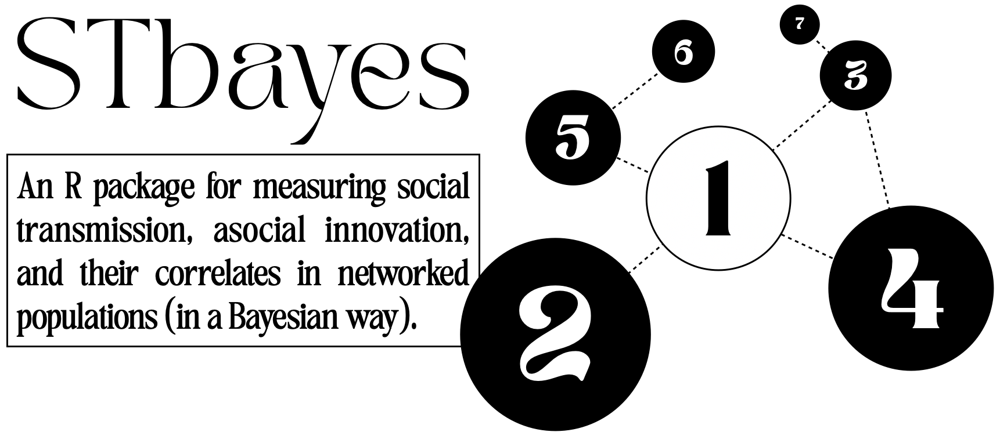

<br><br>

<!-- badges: start -->
<!-- badges: end -->

**STbayes** is an R package for building, fitting and interpreting Bayesian network-based diffusion analyses (NBDA). NBDA models are generally used to identify i) whether social transmission is occurring, ii) correlates of asocial learning and social transmission, iii) pathways of transmission. An overview of the package is now published as an [application article in Methods in Ecology and Evolution](https://doi.org/10.1111/2041-210x.70228).

## Installation<a name="Installation"></a>

STbayes depends on ```cmdstanr```, ```posterior```, ```bayestestR```, ```data.table``` and ```loo```. You can install ```cmdstanr``` by following these [instructions](https://mc-stan.org/cmdstanr/articles/cmdstanr.html). Vignettes use NBDA (install with ```devtools::install_github("whoppitt/NBDA"```), igraph, dplyr, ggplot2, and ggpubr.

To install STbayes:

``` r
# install devtools if not already
if (!require("devtools")) install.packages("devtools")
devtools::install_github("michaelchimento/STbayes")
```
## Citing STbayes
Chimento, M., & Hoppitt, W. (2025). STbayes: An R package for creating, fitting and understanding Bayesian models of social transmission. *Methods in Ecology and Evolution*, 00, 1–10. [https://doi.org/10.1111/2041-210x.70228](https://doi.org/10.1111/2041-210x.70228).

## Getting started

- [Importing data](https://michaelchimento.github.io/STbayes/articles/getting_started.html#step-1-importing-data)
- [Generate a model](https://michaelchimento.github.io/STbayes/articles/getting_started.html#step-2-generate-a-model)
- [Fit and save the model](https://michaelchimento.github.io/STbayes/articles/getting_started.html#step-3-fit-and-save-the-model)
- [Viewing model output](https://michaelchimento.github.io/STbayes/articles/getting_started.html#step-4-viewing-model-output)
- [Posterior predictive checks](https://michaelchimento.github.io/STbayes/articles/getting_started.html#step-5-posterior-predictive-checks)
- [Model comparison](https://michaelchimento.github.io/STbayes/articles/getting_started.html#step-6-model-comparison)

## Advanced recipes

- [Dynamic network models](https://michaelchimento.github.io/STbayes/articles/advanced_recipes.html#dynamic-network-models)
- [Multi-network models](https://michaelchimento.github.io/STbayes/articles/advanced_recipes.html#multi-network-models)
- [Individual-level variables](https://michaelchimento.github.io/STbayes/articles/advanced_recipes.html#individual-level-variables-ilvs)
- [Transmission weights](https://michaelchimento.github.io/STbayes/articles/advanced_recipes.html#transmission-weights)
- [Varying effects](https://michaelchimento.github.io/STbayes/articles/advanced_recipes.html#varying-effects-by-individual-and-trial)
- [Other model types: OADA and dTADA](https://michaelchimento.github.io/STbayes/articles/advanced_recipes.html#other-model-types-oada-and-dtada)
- [Edge weight uncertainty](https://michaelchimento.github.io/STbayes/articles/advanced_recipes.html#edge-weight-uncertainty)
- [Complex Transmission](https://michaelchimento.github.io/STbayes/articles/advanced_recipes.html#complex-transmission)
- [Setting priors](https://michaelchimento.github.io/STbayes/articles/advanced_recipes.html#setting-priors)
- [High resolution data mode](https://michaelchimento.github.io/STbayes/articles/advanced_recipes.html#high-resolution-data-mode)
- [Import NBDA Objects](https://michaelchimento.github.io/STbayes/articles/advanced_recipes.html#import-nbda-data-objects)

## Simulating data for power analyses

- [Basic simulation](https://michaelchimento.github.io/STbayes/articles/simulate_data_for_power_analyses.html)
- [Include ILVs](https://michaelchimento.github.io/STbayes/articles/simulate_data_for_power_analyses.html#include-ilvs)

## Features:

 - TADA (acquisition time known) and OADA (only acquisition order known) model types.
 - static and dynamic networks.
 - multi-network comparison (with static or dynamic networks).
 - multiple trials with the same set, subsets, or different sets of individuals.
 - constant and time-varying ILVs for additive and multiplicative transmission models.
 - varying effects by individual, by trial, or by both for any parameter.
 - easy workflow for ELPD (loo-psis, waic) model comparison.
 - propagation of uncertainty from network measures to transmission model
 - modeling of complex transmission and contagion
