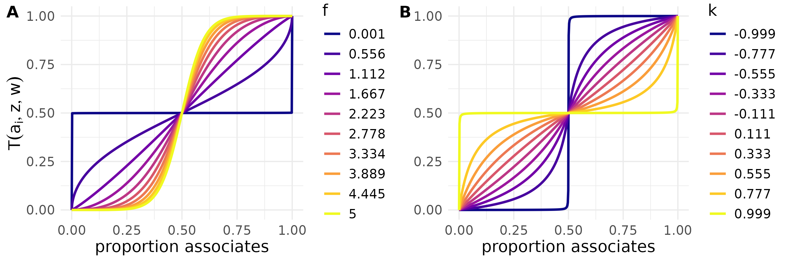

```{r, include = FALSE}
knitr::opts_chunk$set(
  collapse = TRUE,
  comment = "#>", 
  eval=F
)
```

This vignette gives some examples of more advanced/involved uses of STbayes.

```{r setup}
library(STbayes)
```
## Multi-network models

To create a multi-network model, you can just add more columns to the ```networks``` data-frame. Below is a toy data-set of two trials each with 3 individuals, and we define a kin and inverse distance network.

```{r multi-network}
event_data <- data.frame(
    trial = rep(1:2, each = 3),
    id = LETTERS[1:6],
    time = c(2, 1, 3, 4, 2, 1),
    t_end = c(3, 3, 3, 4, 4, 4)
)
networks <- data.frame(
    trial = rep(1:2, each = 3),
    from = c("A", "A", "B", "D", "D", "E"),
    to = c("B", "C", "C", "E", "F", "F"),
    kin = c(1, 0, 1, 0, 1, 1), # first network
    inverse_distance = c(0, 1, .5, .25, .1, 0) #second network
)
data_list <- import_user_STb(
   event_data = event_data,
   networks = networks)
```

## Individual-level variables (ILVs)

Individual-level variables can be either constant (e.g. age, sex) or time-varying (e.g. body condition). Below I define constant ILVs age, sex and weight to add to our toy dataset above.

```{r ILV1}
ILV_c <- data.frame(
    id = LETTERS[1:6],
    age = c(-1, -2, 0, 1, 2, 3), # continuous variables should be normalized
    sex = c(0, 1, 1, 0, 1, 0), # Factor ILVs must be input as numeric
    weight = c(0.5, .25, .3, 0, -.2, -.4)
)
```

The data-frame ILV_c holds the values for each individual. The formatting of ```id``` should match the event_data and networks data-frames. At the moment, ILVs can be continuous or binary. You should normalize continuous variables, and binary variables should be coded as 0, 1. I plan to expand this to multi-category factors, but for the moment you must directly edit the Stan code to use these.

We need to explicitly tell STbayes which variables are additive (acting independently on intrinsic or social rates) and multiplicative (same effect estimated for intrinsic and social rates). Below, I have specified age as acting independently on the intrinsic and social rate, sex as acting only on the social rate, and weight as a multiplicative effect. Thus, two betas will be estimated for age, and a single beta will be estimated for sex and weight.

```{r ILV2}
STb_data <- import_user_STb(
    event_data = event_data,
    networks = networks,
    ILV_c = ILV_c,
    ILVi = c("age"),
    ILVs = c( "age", "sex"),
    ILVm = c("weight")
)

model_obj = generate_STb_model(STb_data)
```

### Time-varying ILVs

Below we add distance from resource as a time-varying ILV. Similar to dynamic networks, these need to be summarized per inter-event interval. For example, the value of ```dist_from_resource``` at ```time=1``` should reflect the average distance of the individual to the resource from the start of the observation period to the first event.

```{r ILV3}
ILV_tv <- data.frame(
    trial = c(rep(1, each = 9),rep(2, each = 9)),
    id = c(rep(LETTERS[1:3], each=3), rep(LETTERS[4:6], each=3)),
    time = c(rep(1:3, times = 3), rep(1:3, times=3)),
    dist_from_resource = rnorm(18)
)

STb_data <- import_user_STb(
    event_data = event_data,
    networks = networks,
    ILV_c = ILV_c,
    ILV_tv = ILV_tv,
    ILVi = c("age", "dist_from_resource"),
    ILVs = c("sex"),
    ILVm = c("weight")
)

model_obj = generate_STb_model(STb_data)
```

Here, we will include it as an additive effect on the intrinsic rate along with age.

## Transmission weights

Transmission weights are vital information that can dramatically improve how the model fits the data. NBDA models have supported _static transmission weights_ ($w_i$), which are usually some rate of behavioural usage. In the context of cultural transmission, individuals who rarely use a novel behaviour have a much lower chance of serving as demonstrators for others compared with individuals who frequently use it. In a study of disease transmission, this might be something like shedding rate. Transmission weights must be 0 or positive: $w_{i}\geq0$, where we divide the number of behaviours $i$ produced by how the duration that individual $i$ is knowledgeable. We just need to define a dataframe with this information. For static transmission weights, we define:

```{r t_weights}
t_weights_static <- data.frame(
    id = LETTERS[1:6],
    t_weight = exp(rnorm(6))
)
```

STbayes introduces the possibility of using _dynamic transmission weights_, which can change over time. Dynamic transmission weights are defined with an additional ```time``` column. Similar to dynamic networks, these integer times correspond to the inter-event intervals. $w_{it}$ are the number of behaviours produced during interval / duration of interval:

```{r t_weights2}
t_weights_dynamic <- data.frame(
    trial = c(rep(1, each = 9),rep(2, each = 9)),
    id = c(rep(LETTERS[1:3], each=3), rep(LETTERS[4:6], each=3)),
    time = c(rep(1:3, times = 3), rep(1:3, times=3)),
    t_weight = exp(rnorm(18))
)
```

These can be included in the model by:

```{r t_weights3}
STb_data <- import_user_STb(
    event_data = event_data,
    networks = networks,
    t_weights = t_weights_dynamic
)
```

You can mix and match static/dynamic networks with static/dynamic transmission weights.

## Varying effects by individual

You may apply varying effects for each individual for the intrinsic rate (lambda_0), social learning rate (s) and any of the ILVs. You do this by specifying specific parameter names using the argument ```veff_ID``` in the call to ```generate_STb_model()``` or ```generate_STb_asocial_model```:

```{r veff, eval=F}
model = generate_STb_model(data_list, veff_ID = c("lambda_0", "s"))
```

For lambda_0 and s, varying effects are added onto the main effect on the log scale. For example, the model would calculate a vector of lambda_0 values for each individual in the ```transformed parameters``` block:

$$
\exp\left(\mu_{\log \lambda_0} + \boldsymbol{v}_{\text{ID}, \lambda_0}\right)
$$
and use those values when calculating the likelihood in the ```model``` block.

## Other model types: OADA and dTADA

## Edge weight uncertainty

Rather than using point estimates for edge weights, it is possible to import posterior distributions of edge weights from bayesian network models, such as those fit by the [bisonr package](https://github.com/JHart96/bisonR/tree/main) or the [STRAND package](https://github.com/ctross/STRAND/tree/main). This is done by providing single fits (or a list of fits) to ```import_user_STb()```.

```{r}
bisonr_fit <- STbayes::bisonr_fit

# network has 10 individuals, create mock diffusion data
event_data <- data.frame(
    trial = 1,
    id = as.character(c(1:10)), #bison fits record ids as characters, even if numeric
    time = sample(1:101, 10, replace = FALSE),
    t_end = 100
)
data_list <- import_user_STb(event_data, networks = bisonr_fit)
model <- generate_STb_model(data_list)

# it's also possible to do multi-network models. 
# here i add two of the same just to illustrate
data_list <- import_user_STb(event_data, networks = list(bisonr_fit, bisonr_fit))
model <- generate_STb_model(data_list)
```

## Complex transmission

STbayes can be used to fit and create models of complex transmission. You can create a log-likelihood that includes a frequency-dependent transmission rules by using the ```transmission_func``` argument of ```generate_STb_model```:

```{r complex_transmission}
data_list = import_user_STb(STbayes::event_data, STbayes::edge_list)
model_f = generate_STb_model(data_list, transmission_func="freqdep_f")
model_k = generate_STb_model(data_list, transmission_func="freqdep_k")
```

The package includes a "freqdep_f" model of frequency-dependent bias as:

$$
\frac{(\text{n knowledgeable associates})^f}
     {(\text{n knowledgeable associates})^f + (\text{n naive associates})^f}
$$

STbayes also includes an _alternative parameterization_ "freqdep_k" based on a scaled version of (Dino Dini's normalized tunable sigmoid function)[https://dinodini.wordpress.com/2010/04/05/normalized-tunable-sigmoid-functions/]. In the first case, f<1 would be evidence of an anti-conformist transmission bias, f=1 would be proportional, and f>1 would be conformist. In the second case, the shape parameter k < 0 is conformist, k=0 proportional, and k>0 anti-conformist. Both parameterizations create a similar relationship between the proportion of informed neighbours and the weight of that information on the rate of an event happening for a given individual:



You might find that one or the other has convergence issues, so we provide both. Complex transmission can be implemented with varying effects, ilvs, oada and ctada type models, etc.

## Setting priors

You might want to customize the priors of your model. Here are the default priors:

```{r}
default_priors <- list(
        log_lambda0 = "normal(-4, 2)", # intrinsic rate
        log_sprime = "normal(-4, 2)", # social transmission rate
        beta_ILV = "normal(0,1)", # beta coefficients for ILVs
        log_f = "normal(0,1)", # exponent parameter under freqdep_f models
        k_raw = "normal(0,3)", # k parameter under freqdep_k models
        z_ID = "normal(0,1)", # varying effects
        sigma_ID = "normal(0,1)", # SD of varying effects
        rho_ID = "lkj_corr_cholesky(3)", # LKJ prior for veff corr matrix
        gamma = "normal(0,1)" # gamma parameter for Weibull intrinsic hazard model
    )
```

To adjust any one of them, call generate_STb_model and provide a named list of those you wish to change in the priors argument. The distributions should be written with the usual Stan convention. You only need to supply those which you wish to change. For example, you might want to tighten your priors on intrinsic rate, social rate and beta params for ILVs.

```{r}
data_list = import_user_STb(STbayes::event_data, STbayes::edge_list)
model <- generate_STb_model(data_list, priors = list(
     log_lambda0 = "normal(-4, 1)",
     log_sprime = "uniform(-4, 1)",
     beta_ILV = "normal(0, .5)"
))
```

At the moment, the function will always print all priors that are possible to specify, regardless of the type of model you are creating. At least this makes it easy to reference the names when you need them.

## Import NBDA data objects

STbayes is compatible with most NBDA objects. The function will try to figure out what was meant to be done with ILVs. However, some features of STbayes require using import_user_STb and I generally encourage you to use the new data format. Read in an NBDA object (taken from Tutorial 4.1 from [Hasenjager et al. 2021](https://doi.org/10.1111/1365-2656.13307)) like so:

```{r}
nbdaData_cTADA <- STbayes::tutorial4_1
data_list = import_NBDA_STb(nbdaData_cTADA)
str(data_list)
```

